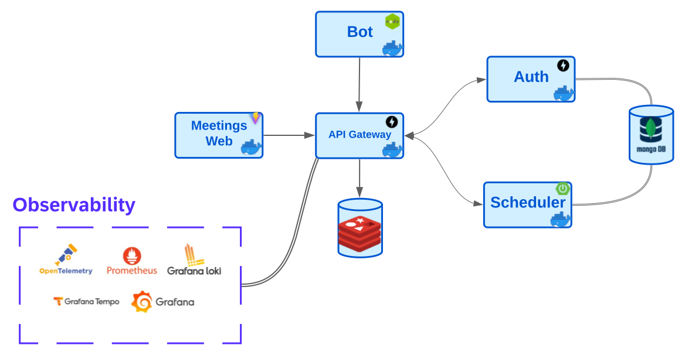
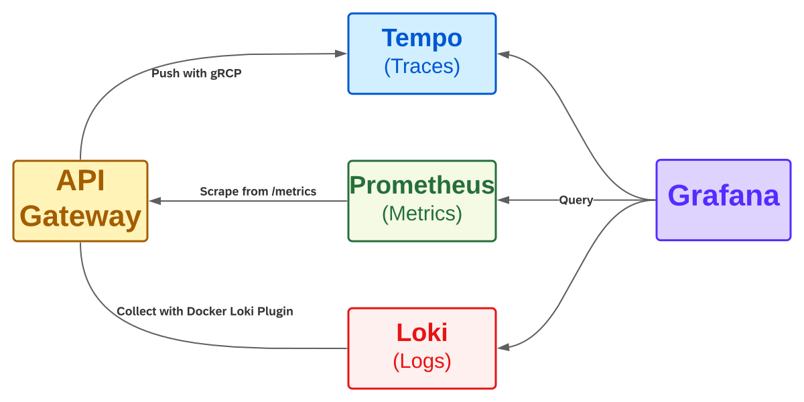

# Meetings

[](https://github.com/tomasanchez/grupo-3-tacs/actions/workflows/auth.yml)
[](https://github.com/tomasanchez/grupo-3-tacs/actions/workflows/auth-dev.yml)
[](https://github.com/tomasanchez/grupo-3-tacs/actions/workflows/scheduler.yml)
[](https://github.com/tomasanchez/grupo-3-tacs/actions/workflows/scheduler-dev.yaml)
[](https://github.com/tomasanchez/grupo-3-tacs/actions/workflows/web-dev.yml)
[](https://github.com/tomasanchez/grupo-3-tacs/actions/workflows/gateway.yml)
[](https://github.com/tomasanchez/grupo-3-tacs/actions/workflows/gateway-dev.yml)

Meetings is an application developed by `Group-3` during the course
Advanced Technologies in Software Construction, as was taught during first semester of 2023.

## Table of Contents

<!-- TOC -->

* [Meetings](#meetings)
    * [Table of Contents](#table-of-contents)
    * [Requirements](#requirements)
    * [Team](#team)
    * [Continuous Integration](#continuous-integration)
    * [Development Environment](#development-environment)
        * [Back-End](#back-end)
        * [API Documentation](#api-documentation)
        * [Front-End](#front-end)
    * [Running Local](#running-local)
    * [Context](#context)
    * [Planned Architecture](#planned-architecture)
    * [License](#license)

<!-- TOC -->

## Requirements

Available
on [docs](https://docs.google.com/document/d/e/2PACX-1vSOjnpw4O-XEjpcK3Yei_FUmBoAQNMwre7mpq81ub2Xqbzy_TRupGIqjIURd4RijgiE7s0fAOlR1DR2/pub)

## Team

| Name                           | File          | e-Mail                            |
|--------------------------------|---------------|-----------------------------------|
| Alvarez, Leandro               | 146.887-0     | lean.alvarez@live.com.ar          |
| Sanchez, Tomas                 | 166.043-3     | tosacnehz@frba.utn.edu.ar         |
| ~~Torregrosa, Florencia~~      | ~~163.519-0~~ | ~~ftorregrossa@frba.utn.edu.ar~~  |      
| ~~Olmedo Paco, Jhon Daniel~~   | ~~152.222-0~~ | ~~jhonpaco@frba.utn.edu.ar~~      |
| Yogui Arakaki, Matias Ezequiel | 167.264-2     | myogui@frba.utn.edu.ar            |
| ~~Grosclaude, Julian~~         | ~~171.656-6~~ | ~~jgrosclaude@frba.utn.edu.ar~~   |

## Continuous Integration

This project uses `GitHub Actions`.

Read more about in the [documentation site](https://docs.github.com/en/actions)

## Development Environment

It is recommended to use [IntelliJ](https://www.jetbrains.com/idea/download/).

1. Clone the repository

Via HTTPS

```bash
git clone https://github.com/tomasanchez/grupo-3-tacs.git
```

or SSH

```bash
git clone git@github.com:tomasanchez/grupo-3-tacs.git
```

2. Install Docker

Read the official website about [Docker](https://docs.docker.com/get-docker/)

### Back-End

For more information about technologies used, how to set up development environment, running local,
read the [`README`](auth/README.md) file on `auth` module, for the scheduler service, [`README`](scheduler/README.md)
file on `scheduler`, and [`README`](api-gateway/README.md) file on `api-gateway` package.

### API Documentation

We are using `OpenAPI` to document our API. You will find all available endpoints, request and
response bodies, along with the status codes that they produce in there.

### Front-End

See [`README`](web/README.md) file on `web` package.

## Quick Start

1. Install [Loki Docker Driver](https://grafana.com/docs/loki/latest/clients/docker-driver/)

   ```bash
   docker plugin install grafana/loki-docker-driver:latest --alias loki --grant-all-permissions
   ```

2. Build application image and start all services with docker-compose

   ```bash
   docker-compose build
   docker-compose up -d
   ```

3. Open the Meetings Web Service [http://localhost:5173](http://localhost:5173) in your browser.

4. Test the api from API Gateway Swagger UI [http://localhost/docs](http://localhost/docs).

5. Check predefined dashboard `FastAPI Observability` on Grafana [http://localhost:3000/](http://localhost:3000/)

## Context

A customer should be able to schedule events, creating, or joining them.
Administrators should be able to see different statistics about the events.

At a high level, we should have different systems, with single responsibilities.
One system should be responsible for managing the workflows of the events, another schedules events,
and the last one for validating users' credentials.


## Planned Architecture

We are planning to have a microservices' architecture. We take into account:

1. Scalability
    - Each service can be scaled independently, allowing for better resource utilization and more efficient scaling.
2. Resilience:
    - If a single component fails, the rest of the application can still function.
3. Technology diversity:
    - Each service can be developed using a different technology stack, allowing for better specialization and more
      efficient development.
4. Deployment:
    - Each service can be deployed independently, allowing for more efficient deployment and better resource
      utilization, as well as faster rollback in case of failure, easier to deploy new features.

Overall, a microservices architecture provides more flexibility, scalability,
and resilience than a monolithic architecture. While it may require more initial setup and
development, it can ultimately make the application easier to maintain and more efficient.



Users will be able to interact with the application through the `Web` module. This module will be responsible for
interacting with the `API Gateway` module, which will be responsible for routing the requests to the corresponding
service. However, this is not the only interface, there is a `Bot` service which allows user interaction via Telegram.

The main idea is to have an `API Gateway` that will serve as an entry point for the communication between the
microservices. It will be responsible for routing the requests to the corresponding service, making the corresponding
validations.

One of these validations will be to limit the number of requests that a user can make in a given time. This will be
done using a `Rate Limiter` as a middleware. For that purpose, we will use `Redis`, It can be interchanged
with a `Redis Cluster` so that we can have a distributed cache, in case more than one instance of the `API Gateway` is
running.

`Auth` module will be responsible for validating users.

`SchedulerApplication` module will be responsible for managing the workflows of the events.

## Observability

Observe the FastAPI application with three pillars of observability on [Grafana](https://github.com/grafana/grafana):

1. Traces with [Tempo](https://github.com/grafana/tempo)
   and [OpenTelemetry Python SDK](https://github.com/open-telemetry/opentelemetry-python)
2. Metrics with [Prometheus](https://prometheus.io/)
   and [Prometheus Python Client](https://github.com/prometheus/client_python)
3. Logs with [Loki](https://github.com/grafana/loki)



## License

All material is provided under an MIT License unless otherwise specified.
MIT License: https://mit-license.org/ or see the [`LICENSE`](./LICENSE) file.

