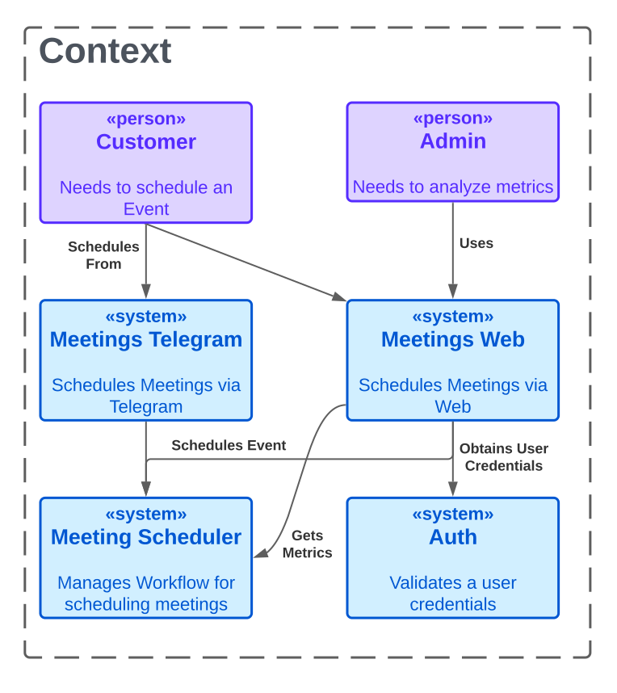
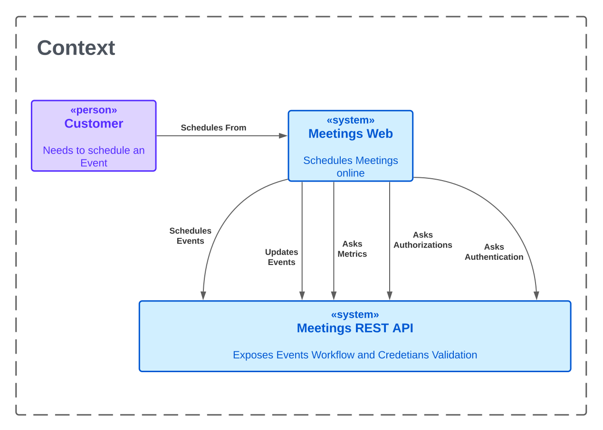

# Meetings

[](https://github.com/tomasanchez/grupo-3-tacs/actions/workflows/rest.yml)
[](https://github.com/tomasanchez/grupo-3-tacs/actions/workflows/rest-image.yml)

Meetings is an application developed by `Group-3` during the course
Advanced Technologies in Software Construction, as was taught during first semester of 2023.

## Table of Contents

<!-- TOC -->
* [Meetings](#meetings)
  * [Table of Contents](#table-of-contents)
  * [Requirements](#requirements)
  * [Team](#team)
  * [Continuous Integration](#continuous-integration)
  * [Development Environment](#development-environment)
    * [Back-End](#back-end)
    * [API Documentation](#api-documentation)
    * [Front-End](#front-end)
  * [Running Local](#running-local)
  * [Context](#context)
  * [Planned Architecture](#planned-architecture)
  * [License](#license)
<!-- TOC -->

## Requirements

Available
on [docs](https://docs.google.com/document/d/e/2PACX-1vSOjnpw4O-XEjpcK3Yei_FUmBoAQNMwre7mpq81ub2Xqbzy_TRupGIqjIURd4RijgiE7s0fAOlR1DR2/pub)

## Team

| Name                           | File      | e-Mail                       |
|--------------------------------|-----------|------------------------------|
| Alvarez, Leandro               | 146.887-0 | lean.alvarez@live.com.ar     |
| Sanchez, Tomas                 | 166.043-3 | tosacnehz@frba.utn.edu.ar    |
| Torregrosa, Florencia          | 163.519-0 | ftorregrossa@frba.utn.edu.ar |      
| Olmedo Paco, Jhon Daniel       | 152.222-0 | jhonpaco@frba.utn.edu.ar     |
| Yogui Arakaki, Matias Ezequiel | 167.264-2 | myogui@frba.utn.edu.ar       |
| Grosclaude, Julian             | 171.656-6 | jgrosclaude@frba.utn.edu.ar  |

## Continuous Integration

This project uses `GitHub Actions`.

Read more about in the [documentation site](https://docs.github.com/en/actions)

## Development Environment

It is recommended to use [IntelliJ](https://www.jetbrains.com/idea/download/).

1. Clone the repository

Via HTTPS

```bash
git clone https://github.com/tomasanchez/grupo-3-tacs.git
```

or SSH

```bash
git clone git@github.com:tomasanchez/grupo-3-tacs.git
```

2. Install Docker

Read the official website about [Docker](https://docs.docker.com/get-docker/)

### Back-End

For more information about technologies used, how to set up development environment, running local,
read the [`README`](./rest/README.md) file on `rest` package.

### API Documentation

We are using `OpenAPI` to document our API. You will find all available endpoints, request and
response bodies, along with the status codes that they produce in there.

This bodies as the current version `0.1.0` is not using any specification for building our APIs
in JSON. However, it is our plan to add [JSON:API](https://jsonapi.org/) in the future.


### Front-End

See [`README`](./web/README.md) file on `web` package.

## Running Local

1. Run docker-compose

```bash
docker-compose up
```

## Context

A customer should be able to schedule events, creating, or joining them.
Administrators should be able to see different statistics about the events.

At a high level, we should have different systems, with single responsibilities.
One system should be responsible for managing the workflows of the events, another schedules events,
and the last one for validating users' credentials.



As for our current version, `v0.1.0`, for simplicity, we are working with this simplified context.



## Planned Architecture

We are planning to have a microservices' architecture. We take into account:

1. Scalability
   - Each service can be scaled independently, allowing for better resource utilization and more efficient scaling.
2. Resilience:
   - If a single component fails, the rest of the application can still function.
3. Technology diversity:
   - Each service can be developed using a different technology stack, allowing for better specialization and more efficient development.
4. Deployment:
   - Each service can be deployed independently, allowing for more efficient deployment and better resource utilization, as well as faster rollback in case of failure, easier to deploy new features.

Overall, a microservices architecture provides more flexibility, scalability,
and resilience than a monolithic architecture. While it may require more initial setup and
development, it can ultimately make the application easier to maintain and more efficient.


## License

All material is provided under an MIT License unless otherwise specified.
MIT License: https://mit-license.org/ or see the [`LICENSE`](./LICENSE) file.

