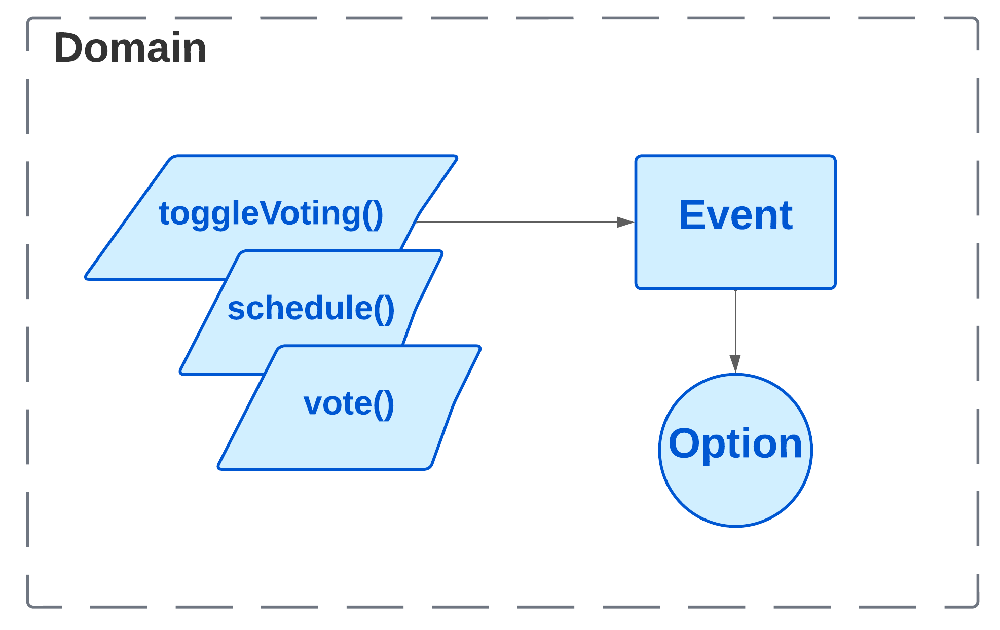
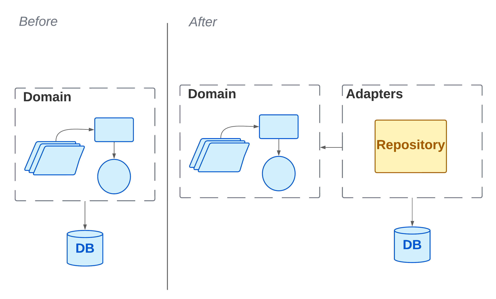
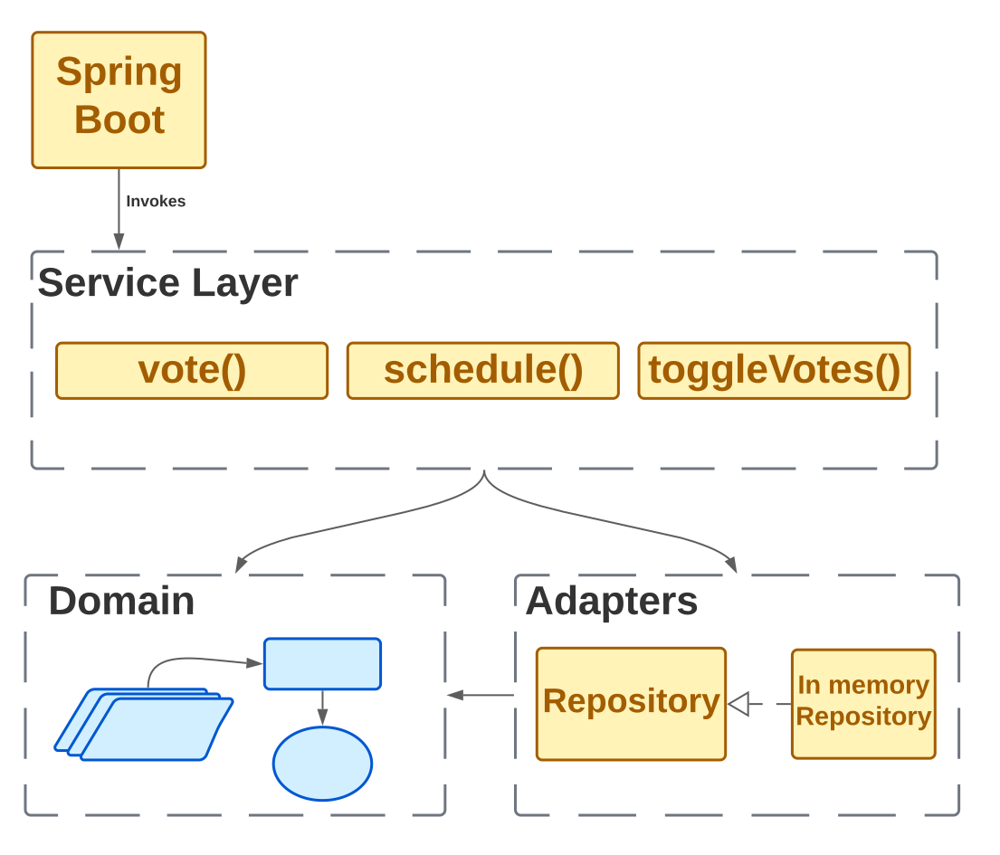
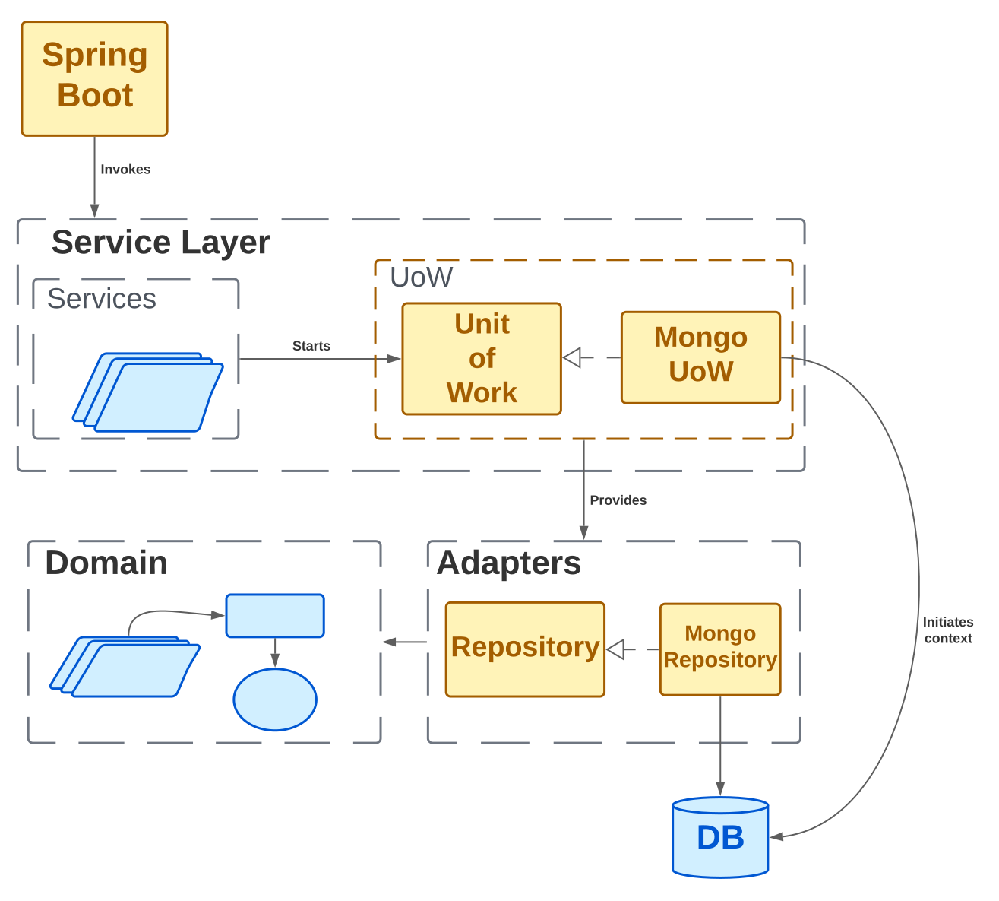
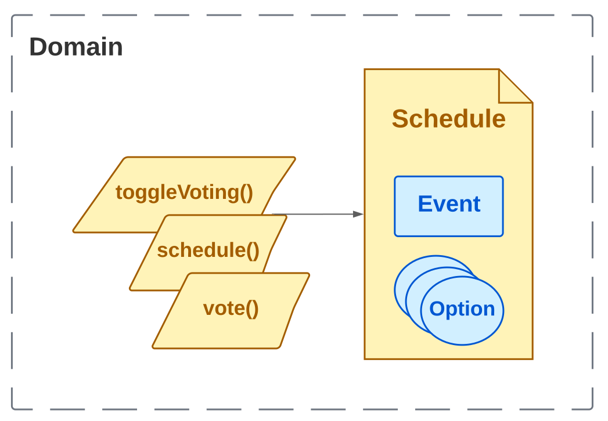

# Meetings REST API

This project contains Meetings Application REST API Service.
This service was built using `Springboot` with `JDK 17` and `Maven`,
also includes support for `Kotlin`.

## Table of Contents

<!-- TOC -->

* [Meetings REST API](#meetings-rest-api)
    * [Table of Contents](#table-of-contents)
    * [Development Environment](#development-environment)
        * [Install Java and Kotlin](#install-java-and-kotlin)
        * [Install Maven](#install-maven)
        * [Running Local](#running-local)
            * [Step 1: Create module from existing source](#step-1--create-module-from-existing-source)
            * [Step 2: Rebuild all packages](#step-2--rebuild-all-packages)
            * [Step 3: Launch the REST service](#step-3--launch-the-rest-service)
    * [Design](#design)
        * [Domain](#domain)
        * [Repository Pattern](#repository-pattern)
        * [Spring Boot and Service Layer](#spring-boot-and-service-layer)
        * [Unit of Work Pattern](#unit-of-work-pattern)

<!-- TOC -->

## Development Environment

### Install Java and Kotlin

Install a `Java 17 SDK` from IntelliJ.

### Install Maven

This package uses Maven for dependency management.

Download Maven for the [official website](https://maven.apache.org/download.cgi).

### Running Local

#### Step 1: Create module from existing source

1. From the File menu, choose `File->New->Module from existing sources`
2. In the resulting dialog, select `grupo-3-tacs/rest/pom.xml`
3. Click Ok

Note that Intellij may take some time rebuilding package indexes.
When you open any file, if prompted to _"Trust"_ the package, then do so.

#### Step 2: Rebuild all packages

1. In the project explorer, right-click `grupo-3-tacs/rest`
2. Choose `Rebuild Module 'rest'`

#### Step 3: Launch the REST service

1. In the project explorer, choose `rest`
2. Drill down through the folders until you find `MeetingsApplication`
3. Right-click `MeetingsApplication` and choose `Run 'MeetingsApplication'`
4. Verify that the service is running by opening a browser and navigating
   to http://localhost:8080/docs
5. If you see the Swagger UI, then the service is running.

## Design

### Domain

The domain is the core of the application. It contains the business logic and the entities that are
used to model the
application.

We identified our main entities as `Event` which represents a scheduling and `Option` the possible
dates for the event.
We have a model for represent these entities, but what we actually need to do is schedule events,
enable/disable voting
and vote for options.

> Sometimes it just isn't a thing.
>
> -- <cite>Eric Evans</cite> in **Domain-Driven Design**

Evans discusses the idea of **Domain Service** operations that don’t have a natural home in an
entity or value object.

### Repository Pattern

We’ll use the Repository pattern, a simplifying abstraction over data storage, allowing us to
decouple our model
layer from the data layer. This simplifying abstraction makes our system more
testable by hiding the complexities of the database.

### Spring Boot and Service Layer

There are differences between orchestration logic, business logic, and interfacing code, and we will
use the Service
Layer pattern to take care of orchestrating our workflows and defining the use cases of our system.

The service layer will become the main way into our app shows what we’re aiming for: we’re going to
add a Spring Boot
API that will talk to the service layer, which will serve as the entrypoint to our domain model.

### Unit of Work Pattern

If the Repository pattern is our abstraction over the idea of persistent storage, the Unit of Work (
UoW) pattern is our
abstraction over the idea of atomic operations. It will allow us to finally and fully decouple our
service layer from
the data layer.

### Aggregates and Consistency Boundaries

Revisiting our domain model to talk about invariants and constraints, and see how our domain objects
can maintain their own internal consistency, both conceptually and in persistent storage.

Adding the Schedule aggregate, shows a preview of where we're headed. We will introduce a new model
object called `Schedule`, which will wrap our event, and multiple options. And our _Domain Services_
will be available as Schedule methods instead.

As we don't want to hold a lock over the entire `Events` collection neither the `Option`, but just
for one particular.
We will use a `version` attribute on our `Schedule` model. This will act as a marker for the whole
state change being complete and to use it as the single resource that concurrent workers can fight
over. This is a optimistic concurrency control.
